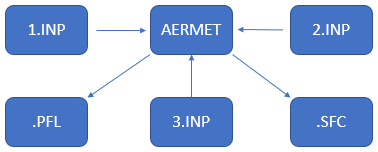
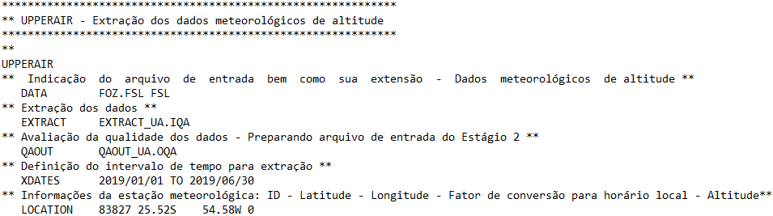
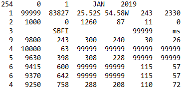
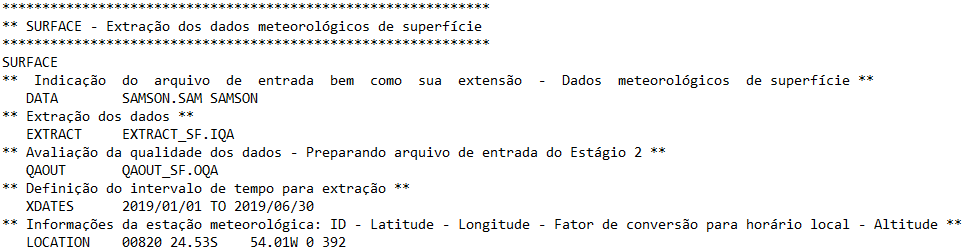
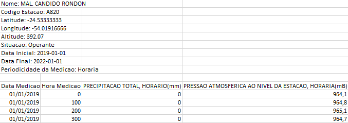
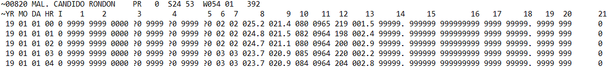
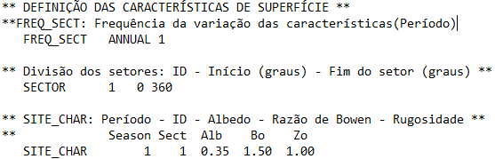
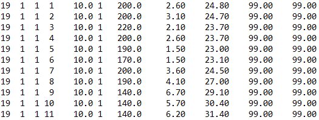
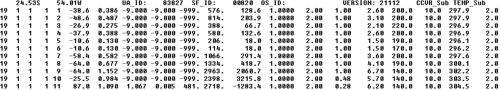

# AERMET Automation

## Overview

The AERMET system is responsible for processing surface and upper-air meteorological data from the study region, including temperature, cloud cover, pressure, dew point, wind speed, and wind direction (USEPA, 2022). In the version used in this research (V22112), the preprocessor consists of three editable INP input files. These files must be configured and executed sequentially to run the AERMET system. After execution, two output files are generated:

- `AERMET.PFL`
- `AERMET.SFC`



*Figure – AERMET workflow.* General workflow of the AERMET preprocessing system.

---

## INP Input File 1

In the first editable INP file, the radiosonde file must be defined. For the case study, the file `FOZ.FSL` was used as the vertical atmospheric profile file to estimate mixing height and turbulence.



*Figure – Radiosonde file configuration.*

The radiosonde dataset was obtained from the Integrated Global Radiosonde Archive (IGRA) provided by the National Oceanic and Atmospheric Administration (NOAA, 2022).

Source:
https://www.ncei.noaa.gov/data/integrated-global-radiosonde-archive

The Foz do Iguaçu-PR station was the closest available to the study area, located approximately 155 km away. According to AERMOD recommendations, meteorological stations should ideally be located within 50 km of the modeling domain center for regulatory applications. In this study, the dataset was used exclusively to demonstrate the technical feasibility of file integration and workflow automation.

The `XDATES` keyword defines the extraction period for the meteorological data. The station code, coordinates, and local time conversion factor must also be configured.



*Figure – Radiosonde file used for upper-air meteorological processing.*

The radiosonde data were copied into a text file and saved in FSL format according to the desired simulation period.

---

## Surface Meteorological File

Another required file is `SAMSON.SAM`, which contains hourly surface meteorological data for the study period.



*Figure – Surface meteorological file configuration.*

The surface dataset includes:

- Solar radiation
- Total cloud cover
- Dry bulb temperature
- Relative humidity
- Precipitation
- Wind direction
- Wind speed

The meteorological data in CSV format were obtained from the Brazilian National Institute of Meteorology (INMET, 1992).

Source:
https://bdmep.inmet.gov.br/



*Figure – Meteorological data obtained from INMET.*

The CSV dataset was used to assemble the `SAMSON.SAM` file.



*Figure – SAMSON-format meteorological file used by AERMET.*

The SAM file structure requires strict formatting rules, including character positions, variable definitions, and missing-value indicators (WRPLOT, 2018).

Source:
https://www.weblakes.com/software/freeware/wrplot-view/

---

## SAMSON File Header Format

| Column | Definition |
|---|---|
| 001 | Header record identifier |
| 002-006 | Station number identifier |
| 008-029 | City name |
| 031-032 | State |
| 033-036 | Local time lag/lead relative to UTC |
| 039-044 | Station latitude |
| 047-053 | Station longitude |
| 056-059 | Station elevation above sea level |

*Table – SAMSON file header format adapted from WRPLOT View user manual (WRPLOT, 2018).*

---

## SAMSON File Body Format

| Column | Definition | Value | Units | Default |
|---|---|---|---|---|
| Header | Year | 1-12 |  |  |
| 002-003 | Month | 1-31 |  |  |
| 005-006 | Day | 1-24 |  |  |
| 008-009 | Hour (LST) |  |  |  |
| 011-012 | Observation indicator |  |  |  |
| 014-017 | Extraterrestrial horizontal radiation | 0-1415 | Wh/m² |  |
| 019-022 | Extraterrestrial direct normal radiation | 0-1415 | Wh/m² |  |
| 024-027 | Global horizontal radiation | 0-1415 | Wh/m² | 9999 |
| 029-029 | Data value | A-H, ? |  |  |
| 030-030 | Flag for data source | 0-9 |  |  |
| 032-035 | Direct normal radiation | 0-1415 | Wh/m² | 9999 |
| 037-037 | Data value | A-H, ? |  |  |
| 038-038 | Flag for data source | 0-9 |  |  |
| 040-043 | Diffuse horizontal radiation | 0-1415 | Wh/m² | 9999 |
| 045-045 | Data value | A-H, ? |  |  |
| 046-046 | Flag for data source | 0-9 |  |  |
| 048-049 | Total cloud cover | 0-10 | Tenths | 99 |
| 051-052 | Opaque cloud cover | 0-10 | Tenths | 99 |
| 054-058 | Dry bulb temperature | -70/60 | °C | 9999 |
| 060-064 | Dew point temperature | -70/60 | °C | 9999 |
| 066-068 | Relative humidity | 0-100 | % | 999 |
| 070-073 | Station pressure | 700-1100 | Millibars | 9999 |
| 075-077 | Wind direction | 0-360 | Degrees | 999 |
| 078-082 | Wind speed | 0-99 | m/s | 99.0 |
| 083-088 | Visibility | 0-160.9 | Km | 99999 |
| 089-094 | Ceiling height | 0-30450 | Meters | 999999 |
| 097-105 | Present weather | 0-9 | Numeric digits |  |
| 106-109 | Precipitable water | 0-100 | Mm | 9999 |
| 110-115 | Broadband aerosol optical depth | 0-0.900 |  | 99999 |
| 116-119 | Snow depth | 0-100 | Cm | 9999 |
| 120-122 | Number of days since last snowfall | 0-88 | Number of days | 999 |
| 124-129 | Hourly precipitation amount | 0-99999 | In/c |  |
| 130-130 | Hourly precipitation flag |  |  |  |

*Table – SAMSON file body format adapted from the WRPLOT View user manual (WRPLOT, 2018).*

---

## Meteorological Data Conversions

Several meteorological variables require unit conversion before generating the SAM file.

### Global Horizontal Radiation

The global horizontal solar radiation from INMET must be converted from kilojoules per square meter to watts per hour per square meter:

```math
VLR = RHG / 3.6
```

Where:

- `VLR` = converted radiation value
- `RHG` = global horizontal radiation value

---

### Cloud Cover Estimation

Cloud cover can be estimated from relative humidity:

```math
CC = 1 - \sqrt{\frac{1 - UR/100}{1 - 0.7}}
```

Where:

- `CC` = cloud cover
- `UR` = relative humidity

If relative humidity equals 99, the cloud cover value receives 10. Negative values are replaced by 0.

---

### Precipitation Conversion

The precipitation value must be converted from millimeters to inches and hundredths:

```math
PP = (PM * 0.0393701) * 100
```

Where:

- `PP` = precipitation in inches and hundredths
- `PM` = precipitation in millimeters

---

### Wind Speed Conversion

The meteorological database provided by MESONET also makes it possible to generate the SAM file through its meteorological records (MESONET, 2024a). A limitation of this dataset is that precipitation data are not available for locations outside the United States, which motivated the use of the INMET meteorological database for the study area.

As the simulations were performed using different annual periods, precipitation was considered an important parameter for evaluating seasonal meteorological variability, such as dry and rainy periods or winter and summer conditions.

The SKNT wind speed column of the MESONET file is provided in knots and must be converted to meters per second accepted by the SAM file:

```math
VM = VN * 0.5144
```

Where:

- `VN` = wind speed in knots
- `VM` = wind speed in meters per second

---

## Weighting for Sky-Level Coverage

There is a weight assigned to the sky-level altitude variables (`SKYL1`, `SKYL2`, `SKYL3`) and sky-level coverage variables (`SKYC1`, `SKYC2`, `SKYC3`) according to the MESONET user manual (MESONET, 2024b).

| Description | Weight |
|---|---|
| CLR | 0 |
| FEW | 1 |
| SCT | 3 |
| BKN | 6 |
| OVC | 8 |
| NSC | 99 |
| VV | 99 |
| VVaaa | 99 |
| /// | 99 |

*Table – Weighting for altitude and sky-level coverage adapted from the MESONET user manual (MESONET, 2024b).* 

### Sky-Level Altitude Conversion

The sky-level altitude variable must be converted from feet to meters:

```math
AM = AP * 0.3048
```

Where:

- `AM` = sky-level altitude in meters
- `AP` = sky-level altitude in feet

---

### Station Pressure Conversion

The pressure altimeter variable must be converted from inches of mercury (inHg) to millibars (mbar):

```math
VM = VP * 33.8639
```

Where:

- `VM` = station pressure in millibars
- `VP` = pressure value in inches of mercury

---

### Temperature Conversion

The MESONET temperature variables are provided in Fahrenheit and must be converted to Celsius:

```math
C = \frac{F - 32}{1.8}
```

Where:

- `C` = temperature in Celsius
- `F` = temperature in Fahrenheit

---

### Visibility Conversion

Visibility values must be converted from miles to kilometers:

```math
Q = M * 1.609344
```

Where:

- `Q` = visibility in kilometers
- `M` = visibility in miles

---

## INP Input File 2

The `AERMET_2.INP` configuration reads the processed data generated in the first stage and creates an intermediate file corresponding to the simulation period.

The `XDATES` keyword defines the simulation period.

---

## INP Input File 3

The `AERMET_3.INP` file reads the intermediate file and generates the final meteorological outputs:

- `AERMET.SFC`
- `AERMET.PFL`

The modeling period must also be defined using the `XDATES` keyword.

---

## Sector Definition and Surface Characteristics

AERMET allows the modeling domain to be divided into sectors to better represent land-use and terrain characteristics.



*Figure – Sector definition and surface characteristics configuration in AERMET.*

The configurable parameters include:

- Albedo
- Bowen ratio
- Surface roughness

The variation frequency may be:

- Annual
- Seasonal
- Monthly

The sectors must cover the entire 360° domain in a clockwise direction from north.

### Southern Hemisphere Season Codes

| Code | Season | Months |
|---|---|---|
| 1 | Winter | June, July, August |
| 2 | Spring | September, October, November |
| 3 | Summer | December, January, February |
| 4 | Autumn | March, April, May |

*Table – Seasonal classification for the southern hemisphere adapted from the AERMET user manual (USEPA, 2022).*

The albedo and Bowen ratio influence the partitioning of incoming solar radiation into sensible and latent heat fluxes (Riihelä et al., 2024; Lin et al., 2022). Surface roughness influences friction velocity and atmospheric turbulence (EPA, 2024).

For the simulations, an annual sector frequency was adopted using a single sector from 0° to 360°. Urban surface characteristics were applied throughout the entire year according to the AERMET user manual (USEPA, 2022).

---

## AERMET Execution

To process the AERMET module, each input file must be renamed sequentially to `AERMET.INP` before execution.

The execution order is:

1. `AERMET_1.INP`
2. `AERMET_2.INP`
3. `AERMET_3.INP`

After execution, the following files are generated:

- `AERMET.SFC`
- `AERMET.PFL`

---

## PFL Output File

The `AERMET.PFL` file contains upper-air vertical profile data generated by AERMET.



*Figure – AERMET.PFL output file.*

---

## SFC Output File

The `AERMET.SFC` file contains processed surface meteorological data.



*Figure – AERMET.SFC output file.*

---

The albedo and Bowen ratio are responsible for the partitioning of incoming solar radiation into sensible and latent heat fluxes (Riihelä et al., 2024; Lin et al., 2022). Surface roughness influences friction velocity and atmospheric turbulence (EPA, 2024).

All instructions used for configuring the AERMET input files were obtained from the AERMET user manual (USEPA, 2022).

---

## References

- EPA. *AERMET User Guide*. United States Environmental Protection Agency, 2024.
- INMET. *Brazilian National Institute of Meteorology Database*, 1992.
- Lin, X. et al. *Partitioning sensible and latent heat fluxes using FLUXNET observations*, 2022.
- MESONET. *Meteorological Data Archive*, 2024.
- NOAA. *Integrated Global Radiosonde Archive (IGRA)*, 2022.
- Riihelä, A. et al. *Global surface albedo variations and radiative effects*, 2024.
- USEPA. *AERMET User Guide*, 2022.
- WRPLOT View User Manual. Lakes Environmental Software, 2018.

